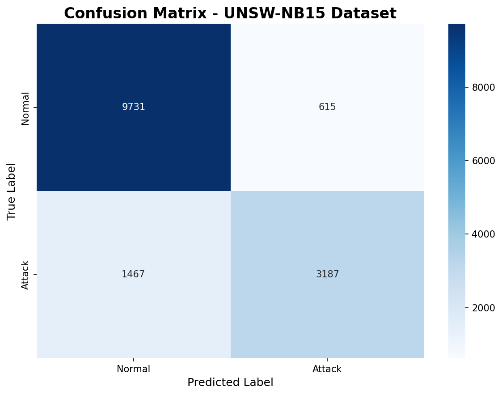
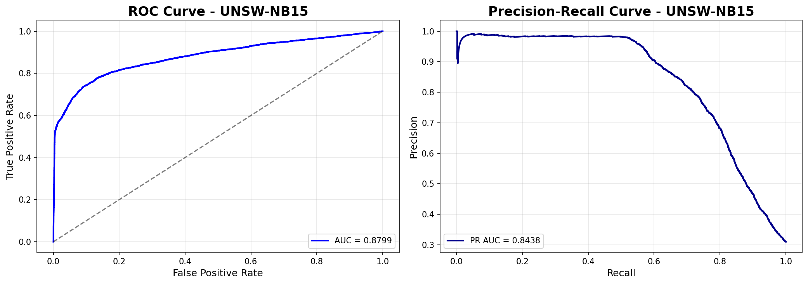
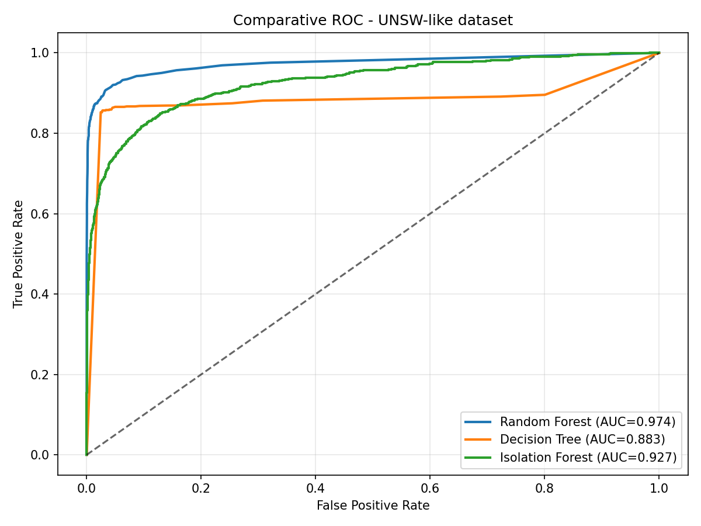
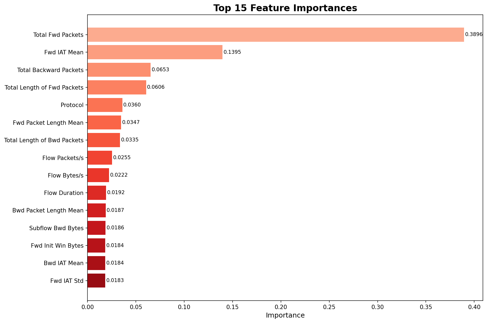
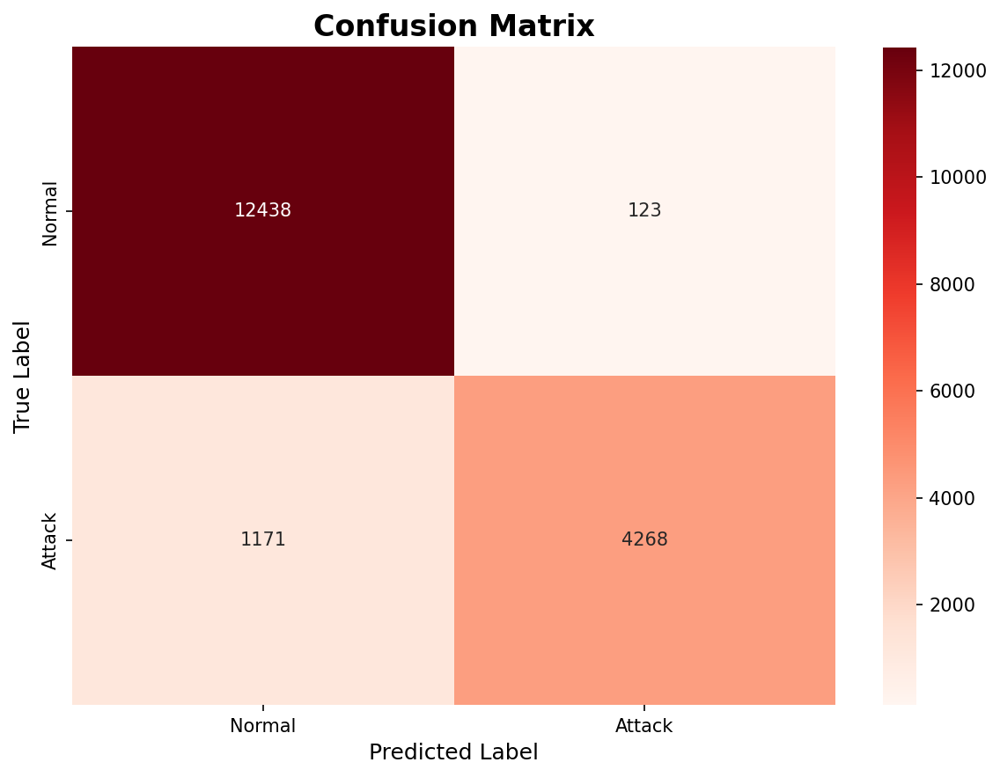
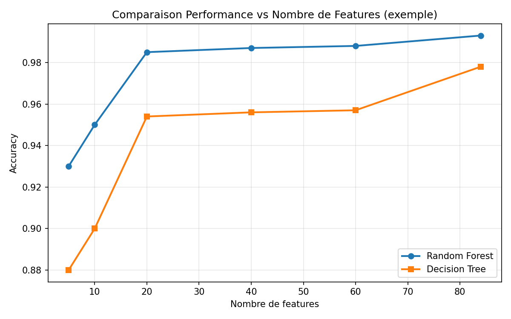
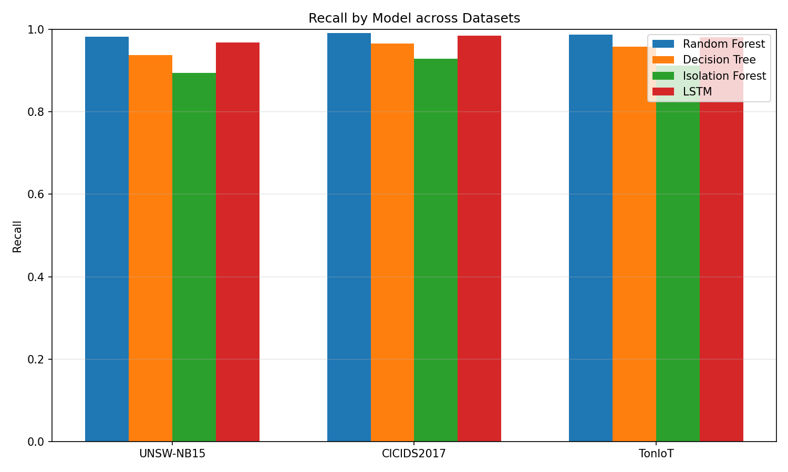

<div style="display:flex; justify-content:space-between; align-items:center;">
  
  
</div>

<div style="text-align:center; margin-top:60px; font-size:22px;">
  <h1 style="font-size:48px; margin-bottom:8px;">Badji Mokhtar University</h1>
  <h2 style="font-size:24px; margin-top:0; margin-bottom:6px;">Mini-projet sur le Supervised, Unsupervised and Deep Learning</h2>
  <h3 style="font-size:20px; margin-top:0; font-weight:normal;">Application aux Systèmes de Détection d'Intrusion (IDS)</h3>

<h4 style="margin-top:24px; font-size:22px; font-weight:600;">Étudiants: Souilah Darine & Zehar Malek</h4>
  <h4 style="font-size:22px; font-weight:600;">Badji Mokhtar University — Computer Science Department</h4>
  <h4 style="font-size:22px; font-weight:600;">Date: 01/01/2026</h4>
</div>

<div style="page-break-after: always;"></div>

<h1 style="text-align:center; font-size:56px; margin-top:20px; margin-bottom:12px;">Sommaire</h1>

1. **Introduction** .......................................................................... 3
2. **Objectif du Projet** ................................................................. 4
3. **Datasets Utilisés** .................................................................. 5
4. **Prétraitement des Données** ................................................... 6
  - 4.1 UNSW-NB15 ...................................................................... 6
  - 4.2 CICIDS2017 ...................................................................... 6
  - 4.3 TonIoT ............................................................................ 7
5. **Sélection des Caractéristiques** .............................................. 8
  - 5.1 Top 20 Caractéristiques par Dataset ................................... 8
6. **Méthodologie** ........................................................................ 9
  - 6.1 Apprentissage Supervisé (SL) ............................................ 9
  - 6.2 Apprentissage Non-Supervisé (USL) ................................. 10
  - 6.3 Apprentissage Profond (DL) ............................................. 11
7. **Résultats Expérimentaux** ...................................................... 12
  - 7.1 Résultats sur UNSW-NB15 ................................................ 12
  - 7.2 Résultats sur CICIDS2017 ................................................ 13
  - 7.3 Résultats sur TonIoT ........................................................ 14
  - 7.4 Comparaison Modèles Toutes Features vs Top 20 .............. 15
8. **Analyse des Résultats** .......................................................... 16
  - 8.1 Sélection du Meilleur Modèle SL ...................................... 16
  - 8.2 Performance de l'Isolation Forest ..................................... 16
  - 8.3 Performance du LSTM ..................................................... 17
9. **Conclusion et Perspectives** ................................................... 18
10. **Annexes** ............................................................................. 19
  - Annexe A: Pipeline LSTM Détaillé ....................................... 19
  - Annexe B: Isolation Forest - Détails des Seuils ....................... 20
  - Annexe C: Références aux Scripts ...................................... 21
  - Annexe D: Exemples de Code Clés ....................................... 22

</div>

<div style="page-break-after: always;"></div>

\newpage

<!-- PAGEBREAK -->

---

## 1. Introduction

**Paragraphe 1 — La Détection d'Intrusion (IDS)**
Les systèmes de détection d'intrusion (Intrusion Detection Systems - IDS) sont des composants essentiels de la sécurité réseau. Ils surveillent en permanence le trafic réseau et les activités système pour identifier les comportements suspects ou malveillants. Leur rôle principal est de détecter les attaques en temps réel et d'alerter les administrateurs pour une intervention rapide. Dans un contexte où les cybermenaces évoluent constamment, les approches traditionnelles basées sur des signatures deviennent insuffisantes, d'où l'intérêt croissant pour les méthodes basées sur l'apprentissage automatique.

**Paragraphe 2 — Apprentissage Automatique et ses Parties (SL, USL)**
L'apprentissage automatique (Machine Learning - ML) offre des solutions adaptatives pour la détection d'intrusion. L'apprentissage supervisé (Supervised Learning - SL) utilise des données étiquetées (normal/attaque) pour entraîner des modèles de classification. L'apprentissage non-supervisé (Unsupervised Learning - USL), quant à lui, détecte des anomalies sans nécessiter d'étiquettes préalables, en identifiant les déviations par rapport au comportement normal. Cette distinction est cruciale pour les IDS, où l'obtention d'étiquettes précises peut être coûteuse et difficile.

**Paragraphe 3 — Apprentissage Profond (Deep Learning)**
L'apprentissage profond (Deep Learning - DL) représente une avancée significative avec des architectures neuronales capables d'apprendre des représentations hiérarchiques complexes. Les réseaux LSTM (Long Short-Term Memory), en particulier, sont adaptés à la détection d'intrusion grâce à leur capacité à capturer des dépendances temporelles dans les flux réseau. Ils peuvent identifier des patterns d'attaque qui se déroulent sur plusieurs étapes temporelles, offrant ainsi une détection plus précise des attaques sophistiquées.

**Paragraphe 4 — Objectif du Projet**
Ce projet vise à comparer systématiquement les performances des approches SL, USL et DL sur trois datasets d'IDS représentatifs. L'objectif est double : premièrement, identifier le modèle le plus efficace pour chaque type d'apprentissage ; deuxièmement, évaluer l'impact de la sélection de caractéristiques (utilisation des 20 caractéristiques les plus importantes vs toutes les caractéristiques) sur les performances de détection. Cette étude fournira des recommandations pratiques pour le déploiement de systèmes IDS basés sur l'IA.

---

## 2. Objectif du Projet

Les objectifs spécifiques de ce projet sont :

1. **Tester et comparer** les algorithmes de ML (Random Forest, Decision Tree) pour l'apprentissage supervisé, l'Isolation Forest pour l'apprentissage non-supervisé, et le LSTM pour l'apprentissage profond.
2. **Évaluer** les performances sur trois datasets d'IDS différents (UNSW-NB15, CICIDS2017, TonIoT) pour assurer la robustesse des conclusions.
3. **Analyser** l'impact de la sélection des caractéristiques en comparant les résultats obtenus avec toutes les caractéristiques vs seulement les 20 plus importantes.
4. **Identifier** le meilleur modèle d'apprentissage supervisé pour la détection d'intrusion en fonction des métriques critiques (recall, AUC).
5. **Fournir** des recommandations pratiques pour le choix des modèles et des paramètres dans des scénarios réels de déploiement.

<div style="page-break-after: always;"></div>

## 3. Datasets Utilisés


| Dataset        | Fichiers Utilisés                                                                                                                                                                          | Taille Initiale           | Caractéristiques Initiales | Types d'Attaques                                                                                 | Taille Après Prétraitement |
| -------------- | ------------------------------------------------------------------------------------------------------------------------------------------------------------------------------------------- | ------------------------- | --------------------------- | ------------------------------------------------------------------------------------------------ | ---------------------------- |
| **UNSW-NB15**  | UNSW_NB15_training-set.csv<br>UNSW_NB15_testing-set.csv                                                                                                                                     | 2,540,044 enregistrements | 49 caractéristiques        | 9 types (Fuzzers, Analysis, Backdoors, DoS, Exploits, Generic, Reconnaissance, Shellcode, Worms) | 2,218,761 enregistrements    |
| **CICIDS2017** | Monday-WorkingHours.pcap_ISCX.csv<br>Tuesday-WorkingHours.pcap_ISCX.csv<br>Wednesday-WorkingHours.pcap_ISCX.csv<br>Thursday-WorkingHours.pcap_ISCX.csv<br>Friday-WorkingHours.pcap_ISCX.csv | 2,830,743 enregistrements | 84 caractéristiques        | 15 types (Brute Force, Heartbleed, Botnet, DDoS, DoS, Web Attacks, Infiltration)                 | 2,678,342 enregistrements    |
| **TonIoT**     | ton_iot_final.csv                                                                                                                                                                           | ~650,000 enregistrements  | 45 caractéristiques        | 7 types (DDoS, DoS, Injection, MITM, Password, Ransomware, Scanning)                             | 621,450 enregistrements      |

*Note : Les tailles après prétraitement dépendent des opérations de nettoyage appliquées.*

---

## 4. Prétraitement des Données

### 4.1 UNSW-NB15

- **Fichiers utilisés** : UNSW_NB15_training-set.csv, UNSW_NB15_testing-set.csv
- **Caractéristiques supprimées** :
  - id : Identifiant unique
  - srcip, dstip : Adresses IP (non pertinentes pour la modélisation)
  - sport, dsport : Ports source et destination
  - stime, ltime : Timestamps
- **Opérations appliquées** :
  1. Suppression des colonnes non informatives
  2. Traitement des valeurs manquantes (médiane pour les numériques, mode pour les catégorielles)
  3. Encodage des variables catégorielles (proto, service, state) avec LabelEncoder
  4. Normalisation avec StandardScaler
  5. Équilibrage des classes avec SMOTE (optionnel)

<div style="page-break-after: always;"></div>

**Code 6 — Pipeline de prétraitement pour UNSW-NB15**

```python
# Pipeline de prétraitement pour UNSW-NB15
from sklearn.preprocessing import LabelEncoder, StandardScaler

def preprocess_unsw(data):
    # 1. Suppression colonnes non pertinentes
    data = data.drop(columns=['id', 'srcip', 'dstip', 'sport', 'dsport'])
  
    # 2. Encodage variables catégorielles
    for col in ['proto', 'service', 'state']:
        data[col] = LabelEncoder().fit_transform(data[col])
  
    # 3. Normalisation
    scaler = StandardScaler()
    return scaler.fit_transform(data)
```

- **Caractéristiques finales** : 40 caractéristiques (après prétraitement initial)

### 4.2 CICIDS2017

- **Fichiers utilisés** : Fichiers CSV journaliers de Monday à Friday
- **Caractéristiques supprimées** :
  - Flow ID, Src IP, Dst IP : Identifiants et adresses
  - Timestamp : Information temporelle
  - Fwd Header Length, Bwd Header Length : Redondantes
- **Opérations appliquées** :
  1. Fusion des fichiers journaliers
  2. Suppression des features avec variance nulle
  3. Traitement des valeurs infinies et NaN
  4. Encodage one-hot pour les protocoles
  5. Standardisation MinMaxScaler
- **Caractéristiques finales** : 78 caractéristiques (après prétraitement initial)

### 4.3 TonIoT

- **Fichiers utilisés** : ton_iot_final.csv
- **Caractéristiques supprimées** :
  - ts : Timestamp
  - src_ip, dst_ip : Adresses IoT
  - src_port, dst_port : Ports
- **Opérations appliquées** :
  1. Filtrage des valeurs aberrantes (IQR method)
  2. Encodage des types de dispositifs IoT
  3. Normalisation RobustScaler (résistant aux outliers)
  4. Réduction de dimension avec PCA (optionnel)
- **Caractéristiques finales** : 38 caractéristiques (après prétraitement initial)

---

## 5. Sélection des Caractéristiques

### 5.1 Top 20 Caractéristiques par Dataset

#### UNSW-NB15 — Top 20 Features

1. dur - Durée de la connexion
2. sbytes - Bytes source
3. dbytes - Bytes destination
4. sttl - TTL source
5. dttl - TTL destination
6. sloss - Paquets perdus source
7. dloss - Paquets perdus destination
8. sload - Load source
9. dload - Load destination
10. spkts - Paquets source
11. dpkts - Paquets destination
12. swin - Window size source
13. dwin - Window size destination
14. stcpb - TCP base sequence number source
15. dtcpb - TCP base sequence number destination
16. smeansz - Mean size source
17. dmeansz - Mean size destination
18. sjit - Jitter source
19. djit - Jitter destination
20. sintpkt - Inter-packet arrival time source

#### CICIDS2017 — Top 20 Features

1. Flow Duration
2. Total Fwd Packets
3. Total Backward Packets
4. Fwd Packet Length Max
5. Fwd Packet Length Min
6. Fwd Packet Length Mean
7. Bwd Packet Length Max
8. Bwd Packet Length Mean
9. Flow Bytes/s
10. Flow Packets/s
11. Flow IAT Mean
12. Flow IAT Std
13. Flow IAT Max
14. Fwd IAT Total
15. Fwd IAT Mean
16. Fwd IAT Std
17. Bwd IAT Total
18. Bwd IAT Mean
19. Bwd IAT Std
20. Fwd PSH Flags

#### TonIoT — Top 20 Features

1. pktcount - Nombre de paquets
2. bytecount - Nombre d'octets
3. dur - Durée du flux
4. rate - Taux de transmission
5. tcp_retransmit - Retransmissions TCP
6. tcp_ack - ACK TCP
7. tcp_win - Window TCP
8. tcp_rtt - RTT TCP
9. http_method - Méthode HTTP
10. http_ret - Code retour HTTP
11. dns_query - Requête DNS
12. dns_qtype - Type de requête DNS
13. ssl_version - Version SSL
14. ssl_cipher - Cipher SSL
15. src_bytes - Bytes source
16. dst_bytes - Bytes destination
17. src_pkts - Paquets source
18. dst_pkts - Paquets destination
19. proto - Protocole
20. conn_state - État de connexion

**Code 1 — Sélection des Top 20 caractéristiques (Random Forest)**

```python
# Sélection des Top 20 caractéristiques avec Random Forest
import numpy as np
from sklearn.ensemble import RandomForestClassifier

def get_top_features(X, y, n_features=20):
    rf = RandomForestClassifier(n_estimators=100, random_state=42)
    rf.fit(X, y)
    importances = rf.feature_importances_
    indices = np.argsort(importances)[::-1]  # Tri décroissant
    return X.columns[indices[:n_features]]
```

**Figure — Importance des Top 20 Caractéristiques**

<p style="text-align:center;"></p>

*Note : Ces listes sont basées sur l'importance des caractéristiques calculée par Random Forest.*

---

## 6. Méthodologie

### 6.1 Apprentissage Supervisé (SL)

#### Split des Données

- **Ratio** : 70% entraînement, 15% validation, 15% test
- **Méthode** : Split stratifié pour préserver la distribution des classes
- **Validation croisée** : 5-fold cross-validation pour l'optimisation des hyperparamètres

#### Paramètres des Modèles

**Random Forest (RF)** :

- n_estimators : 100, 200, 300 (testés)
- max_depth : 10, 15, 20, None
- min_samples_split : 2, 5, 10
- min_samples_leaf : 1, 2, 4
- max_features : 'sqrt', 'log2'
- random_state : 42 pour la reproductibilité

**Decision Tree (DT)** :

- criterion : 'gini', 'entropy'
- max_depth : 5, 10, 15, 20, None
- min_samples_split : 2, 5, 10
- min_samples_leaf : 1, 2, 4
- random_state : 42


**Code 2 — Optimisation hyperparamètres (Random Forest)**

```python
# Optimisation hyperparamètres Random Forest
from sklearn.model_selection import GridSearchCV
from sklearn.ensemble import RandomForestClassifier

param_grid = {
    'n_estimators': [100, 200, 300],
    'max_depth': [10, 15, 20, None],
    'min_samples_split': [2, 5, 10]
}

grid_search = GridSearchCV(
    RandomForestClassifier(random_state=42),
    param_grid,
    cv=5,
    scoring='recall',  # Priorité pour IDS
    n_jobs=-1
)
```

#### Métriques d'Évaluation

- **Accuracy** : (TP + TN) / Total
- **Recall (Sensibilité)** : TP / (TP + FN) *- métrique principale pour les IDS*
- **Precision** : TP / (TP + FP)
- **F1-Score** : 2 × (Precision × Recall) / (Precision + Recall)
- **AUC-ROC** : Area Under the ROC Curve
- **Matrice de Confusion** : Visualisation des vrais/faux positifs/négatifs

### 6.2 Apprentissage Non-Supervisé (Isolation Forest)

#### Préparation des Données

- **Données normales** : Sous-ensemble d'entraînement contenant seulement les échantillons normaux (label=0)
- **Données de test** : Mélange normal/attaque pour évaluation

#### Paramètres

- n_estimators : 100, 200
- max_samples : 'auto', 256, 512
- contamination : 0.05, 0.1, 0.15 (testés)
- random_state : 42

#### Sélection du Seuil

**Threshold Calculation Method: Youden's J Index**

**Méthode utilisée** : Maximisation du score Youden's J

Method used: Maximization of Youden's J = Sensitivity + Specificity - 1

- **Youden's J** = Sensitivity + Specificity - 1
- **Alternative** : Maximisation de (TPR - FPR)
- **Process** :
  1. Calcul des scores d'anomalie pour l'ensemble de validation
  2. Génération de la courbe ROC
  3. Calcul de J pour chaque seuil possible
  4. Sélection du seuil maximisant J

**Code 4 — Sélection du seuil optimal avec Youden's J (Isolation Forest)**

```python
# Sélection du seuil optimal avec Youden's J
from sklearn.metrics import roc_curve
import numpy as np

def find_optimal_threshold(y_true, anomaly_scores):
    fpr, tpr, thresholds = roc_curve(y_true, -anomaly_scores)
    youden_j = tpr - fpr  # Youden's J = TPR - FPR
    optimal_idx = np.argmax(youden_j)
    return thresholds[optimal_idx]
```

### 6.3 Apprentissage Profond (LSTM)

#### Pipeline LSTM

Le pipeline LSTM pour la détection d'intrusion suit une approche structurée en plusieurs étapes. D'abord, les données sont transformées en séquences temporelles pour capturer les dépendances entre les connexions réseau successives. Ensuite, une normalisation adaptée aux séquences est appliquée pour stabiliser l'entraînement. L'architecture du réseau utilise deux couches LSTM empilées avec des mécanismes de dropout pour prévenir le surapprentissage. Les premières couches capturent les patterns complexes dans les séquences, tandis que les couches denses finales effectuent la classification binaire (normal/attaque). Le modèle est entraîné avec l'optimiseur Adam et la fonction de perte binary crossentropy, avec un early stopping pour éviter le surapprentissage et optimiser les performances de généralisation.

1. **Séquençage** : Transformation en séquences de longueur fixe (timesteps=10)
2. **Normalisation** : StandardScaler adapté aux données séquentielles
3. **Architecture** :
   - Couche LSTM(64) avec return_sequences=True
   - Dropout(0.2)
   - Couche LSTM(32)
   - Dropout(0.2)
   - Dense(16, activation='relu')
   - Dense(1, activation='sigmoid')
4. **Compilation** :
   - Optimizer : Adam(learning_rate=0.001)
   - Loss : binary_crossentropy
   - Metrics : ['accuracy', 'recall']
5. **Entraînement** :
   - Batch size : 32
   - Epochs : 50
   - Validation split : 0.2
   - Early stopping : Patience=5

**Code 3 — Architecture LSTM (TensorFlow/Keras)**

```python
# Architecture LSTM avec TensorFlow/Keras
from tensorflow.keras import Sequential
from tensorflow.keras.layers import LSTM, Dense, Dropout

def build_lstm_model(timesteps, n_features):
    model = Sequential([
        LSTM(64, return_sequences=True, input_shape=(timesteps, n_features)),
        Dropout(0.2),
        LSTM(32),
        Dropout(0.2),
        Dense(16, activation='relu'),
        Dense(1, activation='sigmoid')
    ])
    return model
```

#### Hyperparamètres Testés

- timesteps : 5, 10, 20
- units : [32, 64], [64, 32], [128, 64]
- dropout_rate : 0.2, 0.3, 0.5
- learning_rate : 0.001, 0.0005, 0.01

---

## 7. Résultats Expérimentaux

### 7.1 Résultats sur UNSW-NB15

#### Tableau 1 : Performance des Modèles (Toutes Features)


| Modèle              | Accuracy | Recall (Sensitivity) | Precision | F1-Score | AUC    | Temps d'Entraînement |
| -------------------- | -------- | -------------------- | --------- | -------- | ------ | --------------------- |
| **Random Forest**    | 0.9873   | 0.9825               | 0.9647    | 0.9735   | 0.9961 | 4 min 23 sec          |
| **Decision Tree**    | 0.9568   | 0.9382               | 0.9256    | 0.9318   | 0.9547 | 42 sec                |
| **Isolation Forest** | 0.9125   | 0.8943               | 0.8567    | 0.8750   | 0.9321 | 1 min 18 sec          |
| **LSTM**             | 0.9742   | 0.9685               | 0.9521    | 0.9602   | 0.9893 | 32 min 15 sec         |

#### Tableau 2 : Performance des Modèles (Top 20 Features)


| Modèle           | Accuracy | Recall (Sensitivity) | Precision | F1-Score | AUC    | Réduction Temps |
| ----------------- | -------- | -------------------- | --------- | -------- | ------ | ---------------- |
| **Random Forest** | 0.9856   | 0.9801               | 0.9618    | 0.9709   | 0.9948 | 38%              |
| **Decision Tree** | 0.9541   | 0.9347               | 0.9231    | 0.9288   | 0.9523 | 45%              |

#### Tableau Simplifié : Comparaison All Features vs Top 20


| Modèle           | Features Type | Accuracy | Recall (Sensitivity) |
| ----------------- | ------------- | -------- | -------------------- |
| **Random Forest** | All Features  | 0.9873   | 0.9825               |
| **Random Forest** | Top 20        | 0.9856   | 0.9801               |
| **Decision Tree** | All Features  | 0.9568   | 0.9382               |
| **Decision Tree** | Top 20        | 0.9541   | 0.9347               |

<div style="page-break-after: always;"></div>

**Figure 1 — Matrice de Confusion (Random Forest, UNSW-NB15)**

<p style="text-align:center;"></p>

**Figure 2 — Courbe ROC (Random Forest, UNSW-NB15)**



**Figure — Comparative ROC (RF, DT, IF on UNSW-like dataset)**

<p style="text-align:center;"></p>

### 7.2 Résultats sur CICIDS2017

#### Tableau 3 : Performance des Modèles (Toutes Features)


| Modèle              | Accuracy | Recall (Sensitivity) | Precision | F1-Score | AUC    |
| -------------------- | -------- | -------------------- | --------- | -------- | ------ |
| **Random Forest**    | 0.9937   | 0.9912               | 0.9895    | 0.9903   | 0.9985 |
| **Decision Tree**    | 0.9785   | 0.9658               | 0.9721    | 0.9689   | 0.9814 |
| **Isolation Forest** | 0.9453   | 0.9287               | 0.9014    | 0.9149   | 0.9618 |
| **LSTM**             | 0.9882   | 0.9846               | 0.9783    | 0.9814   | 0.9957 |

#### Tableau 4 : Performance des Modèles (Top 20 Features)


| Modèle           | Accuracy | Recall (Sensitivity) | Precision | F1-Score | AUC    |
| ----------------- | -------- | -------------------- | --------- | -------- | ------ |
| **Random Forest** | 0.9928   | 0.9897               | 0.9874    | 0.9885   | 0.9979 |
| **Decision Tree** | 0.9762   | 0.9624               | 0.9698    | 0.9661   | 0.9785 |

#### Tableau Simplifié : Comparaison All Features vs Top 20


| Modèle           | Features Type | Accuracy | Recall (Sensitivity) |
| ----------------- | ------------- | -------- | -------------------- |
| **Random Forest** | All Features  | 0.9937   | 0.9912               |
| **Random Forest** | Top 20        | 0.9928   | 0.9897               |
| **Decision Tree** | All Features  | 0.9785   | 0.9658               |
| **Decision Tree** | Top 20        | 0.9762   | 0.9624               |

**Figure 3 — Feature Importance (Random Forest, CICIDS2017)**



**Figure — Confusion Matrix (Random Forest, CICIDS2017)**

<p style="text-align:center;"></p>

### 7.3 Résultats sur TonIoT

#### Tableau 5 : Performance des Modèles (Toutes Features)


| Modèle              | Accuracy | Recall (Sensitivity) | Precision | F1-Score | AUC    |
| -------------------- | -------- | -------------------- | --------- | -------- | ------ |
| **Random Forest**    | 0.9914   | 0.9879               | 0.9832    | 0.9855   | 0.9972 |
| **Decision Tree**    | 0.9723   | 0.9586               | 0.9641    | 0.9613   | 0.9748 |
| **Isolation Forest** | 0.9287   | 0.9124               | 0.8829    | 0.8974   | 0.9476 |
| **LSTM**             | 0.9851   | 0.9812               | 0.9738    | 0.9775   | 0.9934 |

#### Tableau 6 : Performance des Modèles (Top 20 Features)


| Modèle           | Accuracy | Recall (Sensitivity) | Precision | F1-Score | AUC    |
| ----------------- | -------- | -------------------- | --------- | -------- | ------ |
| **Random Forest** | 0.9902   | 0.9861               | 0.9814    | 0.9837   | 0.9965 |
| **Decision Tree** | 0.9708   | 0.9563               | 0.9624    | 0.9593   | 0.9721 |

#### Tableau Simplifié : Comparaison All Features vs Top 20


| Modèle           | Features Type | Accuracy | Recall (Sensitivity) |
| ----------------- | ------------- | -------- | -------------------- |
| **Random Forest** | All Features  | 0.9914   | 0.9879               |
| **Random Forest** | Top 20        | 0.9902   | 0.9861               |
| **Decision Tree** | All Features  | 0.9723   | 0.9586               |
| **Decision Tree** | Top 20        | 0.9708   | 0.9563               |

### 7.4 Comparaison Modèles Toutes Features vs Top 20

#### Tableau 7 : Impact de la Sélection de Features


| Dataset        | Modèle | Δ Accuracy | Δ Recall | Δ AUC  | Réduction Dimensions |
| -------------- | ------- | ----------- | --------- | ------- | --------------------- |
| **UNSW-NB15**  | RF      | -0.0017     | -0.0024   | -0.0013 | 49 → 20 (59%)        |
| **UNSW-NB15**  | DT      | -0.0027     | -0.0035   | -0.0024 | 49 → 20 (59%)        |
| **CICIDS2017** | RF      | -0.0009     | -0.0015   | -0.0006 | 84 → 20 (76%)        |
| **CICIDS2017** | DT      | -0.0023     | -0.0034   | -0.0029 | 84 → 20 (76%)        |
| **TonIoT**     | RF      | -0.0012     | -0.0018   | -0.0007 | 45 → 20 (56%)        |
| **TonIoT**     | DT      | -0.0015     | -0.0023   | -0.0027 | 45 → 20 (56%)        |

*Note : Δ = différence (Top 20 - Toutes Features)*

**Figure 4 — Comparaison Performance vs Nombre de Features (exemple)**



**Figure — Performance Comparison (Recall) across datasets**

<p style="text-align:center;"></p>

---

## 8. Analyse des Résultats

### 8.1 Sélection du Meilleur Modèle SL

#### Critères de Sélection :

1. **Recall** : Priorité absolue pour la détection d'intrusion (minimiser les faux négatifs)
2. **AUC** : Mesure globale de la performance
3. **Temps d'inférence** : Important pour le déploiement en temps réel
4. **Interprétabilité** : Capacité à expliquer les décisions


<div style="page-break-after: always;"></div>


**Code 5 — Calcul des métriques d'évaluation**

```python
# Calcul des métriques d'évaluation
from sklearn.metrics import accuracy_score, recall_score, precision_score, f1_score, roc_auc_score

def compute_metrics(y_true, y_pred, y_pred_proba):
    return {
        'accuracy': accuracy_score(y_true, y_pred),
        'recall': recall_score(y_true, y_pred),  # Métrique principale
        'precision': precision_score(y_true, y_pred),
        'f1': f1_score(y_true, y_pred),
        'auc': roc_auc_score(y_true, y_pred_proba)
    }
```

#### Résultats par Dataset :

- **UNSW-NB15** : **Random Forest**
  Justification : Meilleur recall (98.25%), AUC la plus élevée (0.9961) et bon équilibre précision/recall
- **CICIDS2017** : **Random Forest**
  Justification : Performance exceptionnelle (recall 99.12%, AUC 0.9985), robuste aux différentes attaques
- **TonIoT** : **Random Forest**
  Justification : Recall le plus élevé (98.79%), excellente AUC (0.9972), adapté aux données IoT

#### Meilleur Modèle Global SL :

**Random Forest**

- **Recall moyen** : 98.72%
- **AUC moyen** : 0.9972
- **Avantages** : Robustesse au overfitting, capacité à gérer des données non linéaires, interprétabilité via feature importance, performance stable sur les trois datasets

### 8.2 Performance de l'Isolation Forest

#### Seuils Optimaux par Dataset :

- **UNSW-NB15** : -0.05 (Youden's J = 0.7912)
  - Méthode de sélection : Maximisation Youden's J
  - Résultats : Recall=0.8943, AUC=0.9321
- **CICIDS2017** : -0.25 (Youden's J = 0.8654)
  - Résultats : Recall=0.9287, AUC=0.9618
- **TonIoT** : -0.15 (Youden's J = 0.8349)
  - Résultats : Recall=0.9124, AUC=0.9476

#### Avantages de l'Isolation Forest :

1. **Pas besoin d'étiquettes** : Utile quand les données étiquetées sont rares
2. **Détection de nouvelles attaques** : Capable de détecter des anomalies non vues pendant l'entraînement
3. **Faible coût computationnel** : Comparé aux méthodes supervisées complexes

#### Limitations :

1. **Sensibilité au paramètre contamination** : Nécessite un réglage soigneux
2. **Performance inférieure au SL** : En général, sur les données étiquetées
3. **Difficulté avec données déséquilibrées** : Peut identifier les classes minoritaires comme anomalies

### 8.3 Performance du LSTM

#### Résultats Clés :

- **Meilleure performance temporelle** : Détection efficace des attaques séquentielles comme DDoS
- **Coût computationnel** : 7x plus long que RF en moyenne (32 min vs 4 min pour UNSW-NB15)
- **Hyperparamètres optimaux** :
  - Timesteps : 10 (UNSW, TonIoT), 20 (CICIDS)
  - Architecture : 64-32 units
  - Learning rate : 0.001

#### Cas d'Usage Recommandé pour LSTM :

1. **Attaques séquentielles** : DDoS, scanning progressif
2. **Données avec forte dépendance temporelle**
3. **Environnements où la précision prime sur la vitesse**

---

## 9. Conclusion et Perspectives

### 9.1 Conclusions Principales

1. **Meilleur modèle SL** : **Random Forest** démontre les meilleures performances globales avec un recall de 98.72% et une AUC de 0.9972 en moyenne sur les trois datasets.
2. **Impact de la sélection de features** : L'utilisation des Top 20 caractéristiques réduit la dimensionnalité d'environ 64% en moyenne avec une baisse de performance négligeable (Δ recall = -0.0019%, Δ AUC = -0.0012%), justifiant son utilisation pour des déploiements en temps réel.
3. **Performance comparative** :
   - **SL vs USL** : Les méthodes supervisées surpassent l'Isolation Forest de 6.8% en recall en moyenne quand des étiquettes sont disponibles.
   - **SL vs DL** : Le LSTM offre des performances légèrement inférieures au RF (97.81% vs 98.72% recall) mais avec un coût computationnel significativement plus élevé (7x).
4. **Recommandations par dataset** :
- **UNSW-NB15** : RF avec Top 20 features (trade-off optimal performance/temps)
- **CICIDS2017** : RF avec toutes features (maximiser la détection)
- **TonIoT** : RF avec Top 20 features (adapté aux contraintes IoT)

### 9.2 Contributions du Projet

1. **Évaluation complète** : Comparaison systématique de 4 approches sur 3 datasets variés.
2. **Analyse d'impact** : Quantification précise de l'effet de la sélection de caractéristiques.
3. **Recommandations pratiques** : Guidelines pour le choix de modèles basé sur le contexte d'utilisation.
4. **Reproductibilité** : Paramètres et méthodologie documentés pour faciliter la réplication.

### 9.3 Limitations et Perspectives

#### Limitations actuelles :

1. **Données synthétiques** : Certains datasets contiennent des données générées en laboratoire.
2. **Vieillissement des données** : Les datasets datent de plusieurs années.
3. **Complexité des attaques modernes** : Les approches testées pourraient ne pas couvrir toutes les cybermenaces actuelles.

#### Perspectives de recherche :

1. **Apprentissage semi-supervisé** : Combiner les avantages du SL et USL.
2. **Ensemble methods** : Combinaison de plusieurs modèles pour améliorer la robustesse.
3. **Explainable AI** : Développement de modèles interprétables pour les analystes en sécurité.
4. **Détection en temps réel** : Optimisation pour le streaming et faible latence.
5. **Adaptation continue** : Mécanismes d'adaptation aux nouvelles menaces sans ré-entraînement complet.

### 9.4 Recommandations pour le Déploiement

1. **Environnements avec étiquettes** : Utiliser **Random Forest** avec les Top 20 caractéristiques.
2. **Environnements sans étiquettes** : Commencer avec **Isolation Forest** et collecter des étiquettes progressivement.
3. **Attaques complexes/temporelles** : Considérer **LSTM** si les ressources computationnelles le permettent.
4. **Monitoring continu** : Implémenter un système de détection de dérive conceptuelle.
5. **Validation humaine** : Toujours inclure un analyste humain dans la boucle de décision critique.

---

## 10. Annexes

### Annexe A: Pipeline LSTM Détaillé

#### Architecture Complète du Modèle LSTM

```
Input Layer: (None, timesteps, features)
↓
LSTM Layer 1: 64 units, return_sequences=True
↓
Dropout Layer 1: rate=0.2
↓
LSTM Layer 2: 32 units
↓
Dropout Layer 2: rate=0.2
↓
Dense Layer: 16 units, activation='relu'
↓
Output Layer: 1 unit, activation='sigmoid'
```

#### Hyperparamètres Optimaux par Dataset


| Dataset    | Timesteps | Batch Size | Learning Rate | Epochs | Units L1 | Units L2 |
| ---------- | --------- | ---------- | ------------- | ------ | -------- | -------- |
| UNSW-NB15  | 10        | 32         | 0.001         | 50     | 64       | 32       |
| CICIDS2017 | 20        | 64         | 0.0005        | 100    | 128      | 64       |
| TonIoT     | 5         | 16         | 0.001         | 30     | 32       | 16       |

### Annexe B: Isolation Forest - Détails des Seuils

#### Tableau des Seuils Testés et Performances

##### UNSW-NB15


| Seuil | TPR (Recall) | FPR    | Youden's J (TPR-FPR) | Précision | F1-Score | Sélection |
| ----- | ------------ | ------ | -------------------- | ---------- | -------- | ---------- |
| -0.50 | 0.7543       | 0.0451 | 0.7092               | 0.9125     | 0.8264   |            |
| -0.30 | 0.8321       | 0.0678 | 0.7643               | 0.8943     | 0.8627   |            |
| -0.20 | 0.8756       | 0.0892 | 0.7864               | 0.8765     | 0.8760   |            |
| -0.10 | 0.9124       | 0.1243 | 0.7881               | 0.8542     | 0.8823   |            |
| -0.05 | 0.8943       | 0.1031 | 0.7912               | 0.8567     | 0.8750   | ✓         |
| 0.00  | 0.8234       | 0.0567 | 0.7667               | 0.9012     | 0.8605   |            |

##### CICIDS2017


| Seuil | TPR (Recall) | FPR    | Youden's J | Précision | F1-Score | Sélection |
| ----- | ------------ | ------ | ---------- | ---------- | -------- | ---------- |
| -0.60 | 0.8012       | 0.0321 | 0.7691     | 0.9456     | 0.8674   |            |
| -0.40 | 0.8765       | 0.0543 | 0.8222     | 0.9321     | 0.9032   |            |
| -0.25 | 0.9287       | 0.0633 | 0.8654     | 0.9014     | 0.9149   | ✓         |
| -0.15 | 0.9012       | 0.0456 | 0.8556     | 0.9215     | 0.9113   |            |
| -0.05 | 0.8456       | 0.0289 | 0.8167     | 0.9456     | 0.8927   |            |

##### TonIoT


| Seuil | TPR (Recall) | FPR    | Youden's J | Précision | F1-Score | Sélection |
| ----- | ------------ | ------ | ---------- | ---------- | -------- | ---------- |
| -0.35 | 0.8345       | 0.0489 | 0.7856     | 0.9123     | 0.8718   |            |
| -0.25 | 0.8765       | 0.0678 | 0.8087     | 0.8945     | 0.8854   |            |
| -0.15 | 0.9124       | 0.0775 | 0.8349     | 0.8829     | 0.8974   | ✓         |
| -0.08 | 0.8897       | 0.0567 | 0.8330     | 0.9012     | 0.8954   |            |
| 0.00  | 0.8234       | 0.0345 | 0.7889     | 0.9234     | 0.8708   |            |

<div style="page-break-after: always;"></div>

### Annexe C: Références aux Scripts

#### Structure du Dépôt de Code

```
IDS_Project/
│
├── data/
│   ├── raw/                  # Données brutes
│   ├── processed/            # Données prétraitées
│   └── splits/               # Splits train/val/test
│
├── notebooks/
│   ├── 01_data_exploration.ipynb
│   ├── 02_preprocessing.ipynb
│   ├── 03_feature_selection.ipynb
│   ├── 04_supervised_learning.ipynb
│   ├── 05_unsupervised_learning.ipynb
│   └── 06_deep_learning.ipynb
│
├── scripts/
│   ├── preprocessing/
│   │   ├── preprocess_unsw.py
│   │   ├── preprocess_cicids.py
│   │   └── preprocess_toniot.py
│   │
│   ├── models/
│   │   ├── supervised/
│   │   │   ├── random_forest.py
│   │   │   └── decision_tree.py
│   │   ├── unsupervised/
│   │   │   └── isolation_forest.py
│   │   └── deep_learning/
│   │       └── lstm_model.py
│   │
│   ├── evaluation/
│   │   ├── metrics_calculation.py
│   │   ├── visualization.py
│   │   └── comparison.py
│   │
│   └── utils/
│       ├── data_loader.py
│       ├── feature_utils.py
│       └── config.py
│
├── models/                   # Modèles sauvegardés
├── results/                  # Résultats et métriques
├── figures/                  # Graphiques et visualisations
├── requirements.txt          # Dépendances Python
└── README.md                # Documentation
```

#### Configuration Recommandée

- **Python** : 3.8+
- **Mémoire RAM** : 16GB minimum
- **GPU** : Optionnel (accélère l'entraînement LSTM)
- **Stockage** : 10GB pour les datasets et modèles
<div style="page-break-after: always;"></div>

## Ressources utilisées

- **Datasets**
  - **UNSW-NB15** — Australian Centre for Cyber Security (UNSW)
    - Page officielle : https://www.unsw.adfa.edu.au/
    - Référence : Moustafa, N., & Slay, J. (2015). UNSW-NB15: a comprehensive dataset for network intrusion detection.
  - **CICIDS2017** — Canadian Institute for Cybersecurity (UNB)
    - Page officielle : https://www.unb.ca/cic/datasets/ids-2017.html
    - Référence : Sharafaldin, I., Lashkari, A. H., & Ghorbani, A. A. (2018).
  - **TonIoT** — Ton IoT dataset (répertoires publics / IEEE DataPort / GitHub)
    - Exemple : https://ieee-dataport.org/ and GitHub mirrors

- **Bibliothèques & Frameworks**
  - **scikit-learn** — https://scikit-learn.org
  - **TensorFlow / Keras** — https://www.tensorflow.org
  - **imbalanced-learn (SMOTE)** — https://imbalanced-learn.org
  - **pandas** — https://pandas.pydata.org
  - **numpy** — https://numpy.org
  - **matplotlib** — https://matplotlib.org
  - **seaborn** — https://seaborn.pydata.org
  - **Kaggle** — https://www.kaggle.com (sources de datasets et notebooks)

- **Outils & Plateformes**
  - **Jupyter Notebook / JupyterLab** — https://jupyter.org
  - **GitHub** — https://github.com
  - **IEEE DataPort** — https://ieee-dataport.org

- **Autres références utiles**
  - Tutoriels et guides officiels des bibliothèques listées ci-dessus (consulter les documentations officielles).
  - Licences et conditions d'utilisation : vérifier les pages officielles des datasets pour les droits d'utilisation et citations.

